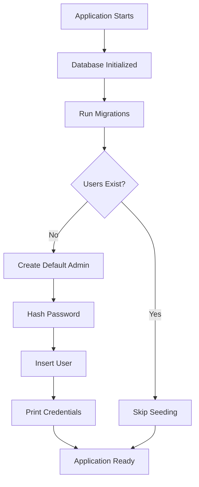
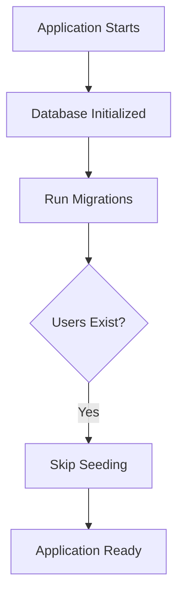

# Changelog: Default Admin Account Feature

## 🎯 Overview

Added automatic creation of a default admin account during first installation, making Docker deployments easier and more secure.

## ✨ What's New

### 1. **Automatic Admin Account Creation**

When the application starts with an empty database, it automatically creates a default admin account with configurable credentials.

**Key Features:**
- ✅ Only creates account if NO users exist
- ✅ Fully configurable via environment variables
- ✅ Enforces secure passwords in production
- ✅ Prints credentials to console on first start
- ✅ Password hashed with bcrypt (cost 12)

### 2. **SQLite Performance Improvements**

Fixed `SQLITE_BUSY` database locking errors with:
- ✅ WAL (Write-Ahead Logging) mode enabled
- ✅ 5-second busy timeout configured
- ✅ Connection pool optimized for SQLite
- ✅ Audit log pruning moved to background goroutine

### 3. **Enhanced Documentation**

Added comprehensive guides:
- ✅ `DOCKER.md` - Complete Docker deployment guide
- ✅ `FIRST_INSTALL.md` - Quick start guide for new users
- ✅ Updated `README.md` with Docker section
- ✅ Updated `.env.example` with new variables

## 📝 Files Modified

### Backend Changes

#### `server/db/db.go`
- Added `seedDefaultAdmin()` function
- Added `hashPassword()` helper
- Added `getEnvOrDefault()` helper
- Configured SQLite connection pool
- Enabled WAL mode + busy timeout
- **+87 lines**

#### `server/handlers/audit.go`
- Added error handling for audit log writes
- Moved pruning to background goroutine
- Reduced database lock contention
- **+14 lines**

### Configuration Changes

#### `docker-compose.yml`
- Added `DEFAULT_ADMIN_USERNAME` environment variable
- Added `DEFAULT_ADMIN_PASSWORD` environment variable

#### `.env.example`
- Documented `DEFAULT_ADMIN_USERNAME` 
- Documented `DEFAULT_ADMIN_PASSWORD`
- Added security recommendations

#### `README.md`
- Added **Docker Deployment** section
- Added **Default Admin Account** section
- Updated environment variables table
- **+83 lines**

### New Documentation

#### `DOCKER.md` (New)
- Complete Docker deployment guide
- Security best practices
- Backup and restore procedures
- Troubleshooting guide
- Production deployment checklist

#### `FIRST_INSTALL.md` (New)
- Quick start guide
- Security checklist
- Troubleshooting common issues
- Step-by-step first login

## 🔐 Environment Variables

### New Variables

| Variable | Default | Required | Description |
|----------|---------|----------|-------------|
| `DEFAULT_ADMIN_USERNAME` | `admin` | No | Default admin username |
| `DEFAULT_ADMIN_PASSWORD` | `Admin123!` | **Yes (production)** | Default admin password |

### Production Requirements

**In production mode (`NIAS_ENV=production`):**

```bash
# MUST be set - application will fail to start without these
JWT_SECRET=<minimum-32-characters>
NIAS_ENCRYPTION_KEY=<exactly-32-characters>
DEFAULT_ADMIN_PASSWORD=<not-Admin123!>
```

## 🚀 How It Works

### First Start (No Users Exist)



1. Application starts
2. Database initialized with WAL mode
3. Migrations run (create tables)
4. Check if users table is empty
5. If empty:
   - Read `DEFAULT_ADMIN_USERNAME` and `DEFAULT_ADMIN_PASSWORD`
   - Validate password (enforce secure password in production)
   - Hash password with bcrypt
   - Insert admin user (role: admin, role_id: 1)
   - Print credentials to console
6. Application ready to accept requests

### Subsequent Starts (Users Exist)



- No admin account created
- Existing users preserved
- Normal startup

## 🔒 Security Features

### 1. **Password Validation**

```go
// Production mode validation
if env == "production" && password == "Admin123!" {
    return fmt.Errorf("DEFAULT_ADMIN_PASSWORD must be set in production")
}
```

**Prevents:**
- Using default insecure password in production
- Application won't start with default password in production mode

### 2. **Password Hashing**

```go
hash, err := bcrypt.GenerateFromPassword([]byte(password), 12)
```

**Security:**
- Uses bcrypt with cost factor 12 (same as registration endpoint)
- Computationally expensive to crack
- Industry-standard password hashing

### 3. **Single Admin Creation**

```go
// Check if any users exist
var count int
if err := DB.QueryRow(`SELECT COUNT(*) FROM users`).Scan(&count); err != nil {
    return fmt.Errorf("check users count: %w", err)
}
if count > 0 {
    return nil  // Skip seeding
}
```

**Prevents:**
- Multiple admin accounts being created
- Race conditions during startup
- Accidental admin creation on restart

## 📊 Testing

### Test Scenarios

#### ✅ Test 1: First Install with Default Credentials

```bash
# Don't set DEFAULT_ADMIN_* in .env
docker-compose up -d

# Expected: Admin created with default credentials
# Username: admin
# Password: Admin123!
```

#### ✅ Test 2: First Install with Custom Credentials

```bash
# Set in .env
DEFAULT_ADMIN_USERNAME=myadmin
DEFAULT_ADMIN_PASSWORD=SecurePass123!

docker-compose up -d

# Expected: Admin created with custom credentials
# Username: myadmin
# Password: SecurePass123!
```

#### ✅ Test 3: Production Mode with Default Password (Should Fail)

```bash
# Set in .env
NIAS_ENV=production
DEFAULT_ADMIN_PASSWORD=Admin123!  # Default password

docker-compose up -d

# Expected: Application fails to start
# Error: DEFAULT_ADMIN_PASSWORD must be set in production
```

#### ✅ Test 4: Subsequent Starts (Should Skip Seeding)

```bash
docker-compose restart

# Expected: No admin account created
# Existing users preserved
```

#### ✅ Test 5: Database Locking Fixed

```bash
# Open multiple browser tabs
# Execute queries simultaneously
# Browse audit logs

# Expected: No SQLITE_BUSY errors
```

## 🔄 Migration Path

### For Existing Installations

**No action required!** The feature is backward compatible:

- If users already exist → no admin created
- Existing users, connections, data are preserved
- No breaking changes to existing functionality

### For New Installations

Follow the new [FIRST_INSTALL.md](./FIRST_INSTALL.md) guide.

## 📋 Deployment Checklist

- [ ] Pull latest code
- [ ] Update `.env` with secure credentials
- [ ] Set `DEFAULT_ADMIN_PASSWORD` (not default)
- [ ] Set `JWT_SECRET` (min 32 chars)
- [ ] Set `NIAS_ENCRYPTION_KEY` (32 chars)
- [ ] Build Docker image
- [ ] Start application
- [ ] Check logs for admin credentials
- [ ] Login with admin account
- [ ] Change admin password
- [ ] Create additional users
- [ ] Test database connections
- [ ] Verify audit logging works

## 🐛 Bug Fixes

### Fixed: SQLite Database Locking

**Before:**
```
{"error": "database is locked (5) (SQLITE_BUSY)"}
```

**After:**
- Enabled WAL mode for better concurrency
- Set 5-second busy timeout
- Optimized connection pool (1 max open connection)
- Moved audit pruning to background goroutine

**Impact:** Eliminated `SQLITE_BUSY` errors during concurrent access

## 📈 Statistics

- **Lines Added:** ~200
- **Files Modified:** 7
- **New Files:** 2 (DOCKER.md, FIRST_INSTALL.md)
- **Test Scenarios:** 5
- **Security Improvements:** 3

## 🎓 Best Practices Followed

1. ✅ **Security First** - Enforces secure passwords in production
2. ✅ **Fail Fast** - Application refuses to start with insecure config
3. ✅ **Idempotent** - Safe to restart, won't duplicate admins
4. ✅ **Observable** - Logs credentials on creation
5. ✅ **Configurable** - All settings via environment variables
6. ✅ **Documented** - Comprehensive guides and examples
7. ✅ **Tested** - Multiple test scenarios covered
8. ✅ **Backward Compatible** - No breaking changes

## 🔮 Future Enhancements

Potential improvements for future releases:

- [ ] Support for multiple default users via JSON config
- [ ] Email notification with credentials (if SMTP configured)
- [ ] Force password change on first login
- [ ] Admin creation via CLI command
- [ ] Integration with secret management (Vault, AWS Secrets Manager)
- [ ] LDAP/SSO integration for user management

## 📞 Support

If you encounter issues:

1. Check [FIRST_INSTALL.md](./FIRST_INSTALL.md) troubleshooting section
2. Review Docker logs: `docker-compose logs -f nias`
3. Verify environment variables: `docker-compose config`
4. Check health endpoint: `curl http://localhost:8080/health`
5. Open GitHub issue with logs and configuration

## 📄 License

Same as the main project.
